# Programación Orientada a Objetos

## YOEL ANDEYCI PILIER MARTINEZ

### [yapmartinez@oymas.edu.do](mailto:yapmartinez@oymas.edu.do)

---

# Programación Orientada a Objetos

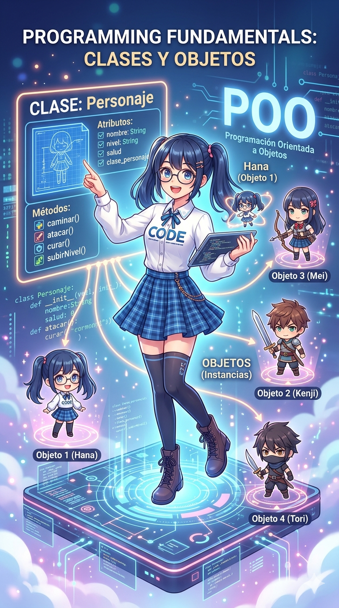

La Programación Orientada a Objetos (POO) es un paradigma de programación que organiza el código mediante objetos.

Un objeto combina:

- Datos (atributos)
- Comportamientos (métodos)

---

# Conceptos Fundamentales

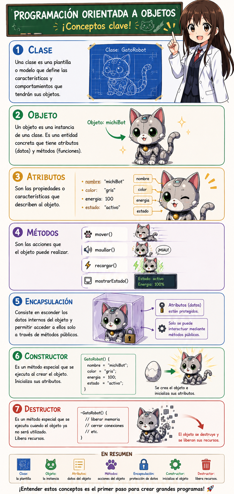

- Clase
- Objeto
- Atributos
- Métodos
- Encapsulación
- Constructor
- Destructor

---

# ¿Qué es una Clase?

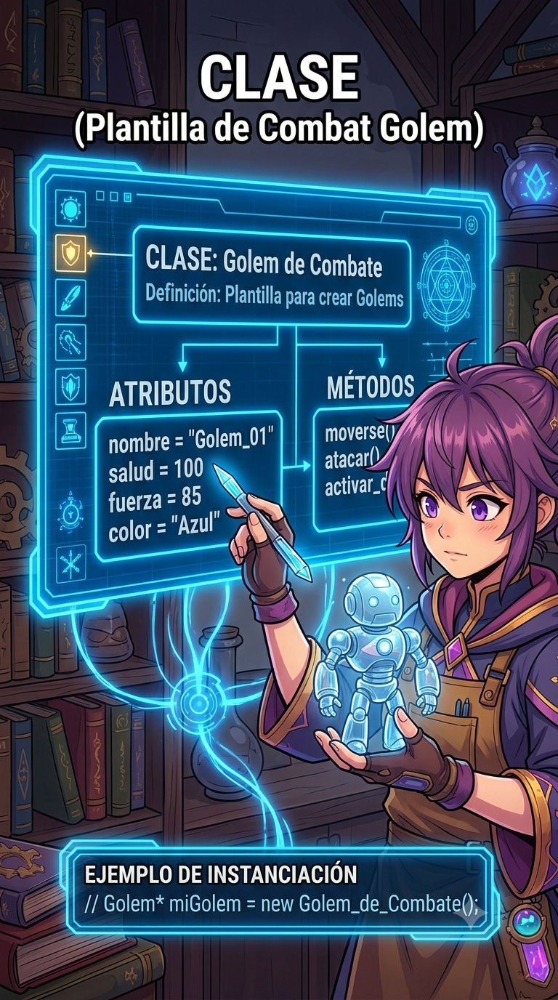

Una clase es una plantilla para crear objetos.

```cpp
class Persona {
public:
    std::string nombre;
    int edad;
};
```

---

# ¿Qué es un Objeto?

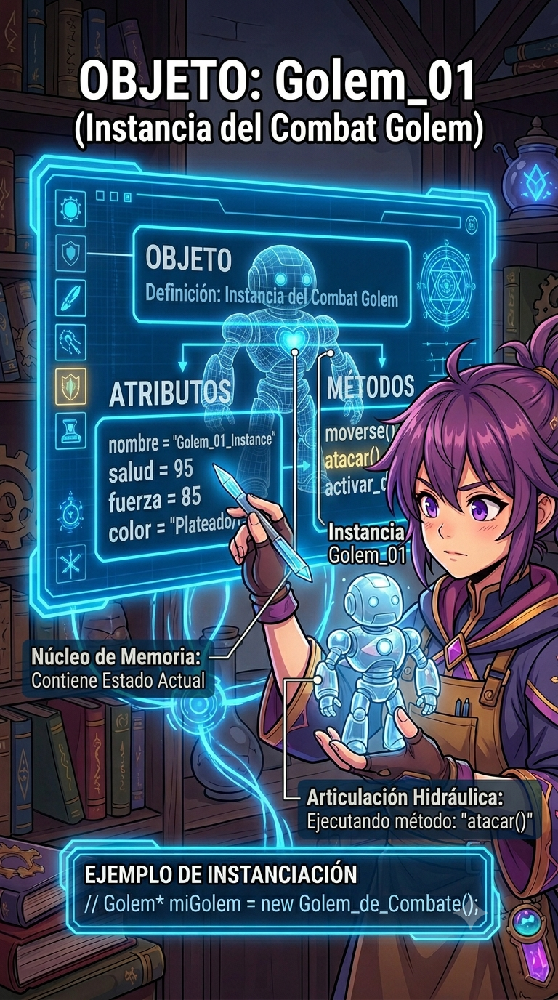

Un objeto es una instancia de una clase.

```cpp
Persona persona1;

persona1.nombre = "Juan";
persona1.edad = 20;
```

---

# Clase vs Objeto

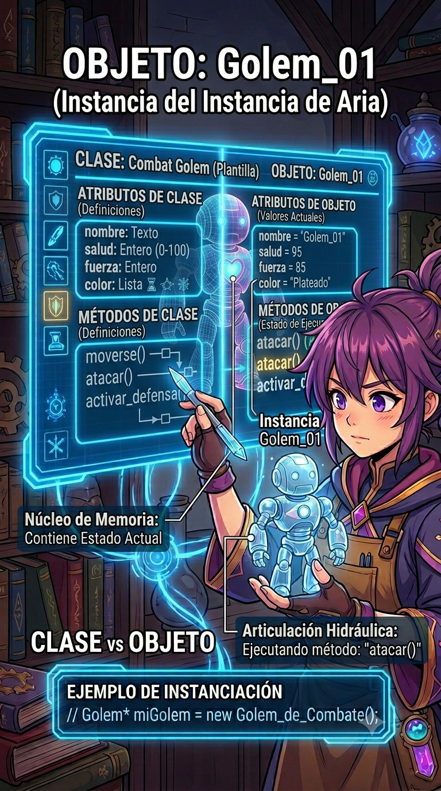

| Clase | Objeto |
|---------|---------|
| Plano de una casa | Casa construida |
| Molde | Figura creada |
| Persona | Juan |
| Vehículo | Carro de Juan |

---

# Atributos

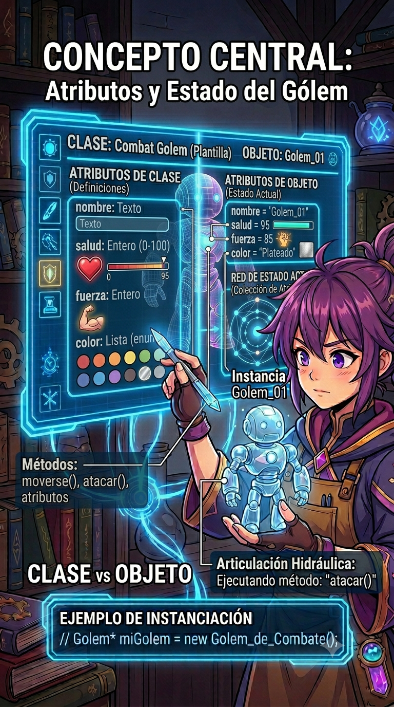

Los atributos representan características del objeto.

```cpp
class Persona {
public:
    std::string nombre;
    int edad;
    double altura;
};
```

---

# Métodos

Los métodos representan acciones del objeto.

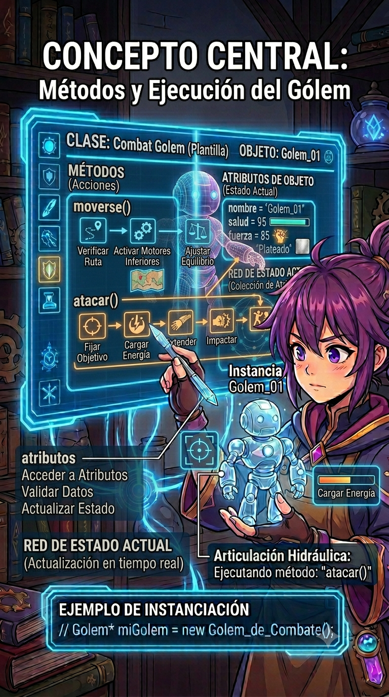

```cpp
class Persona {
public:
    void saludar() {
        std::cout << "Hola!" << std::endl;
    }
};
```

---

# Uso de Métodos


```cpp
Persona persona;

persona.saludar();
```

---

# Public, Private y Protected
 
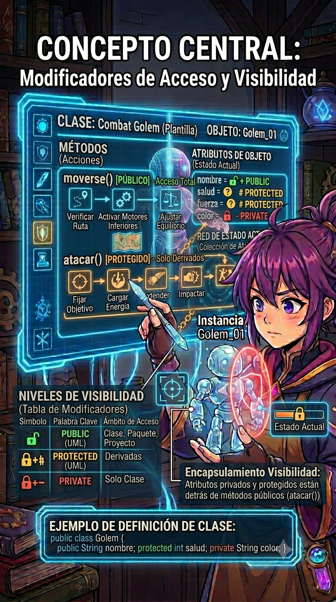

Controlan el acceso a los miembros de la clase.

```cpp
class Persona {
public:
    std::string nombre;

protected:
    std::string apellido;

private:
    int edad;

};
```

---

# Miembros Públicos


Los miembros públicos pueden accederse desde cualquier lugar.

```cpp
Persona persona;

persona.nombre = "Juan";
```

---

# Miembros Privados


Los miembros privados solo pueden utilizarse dentro de la clase.

```cpp
Persona persona;

persona.edad = 20; // Error
```
---

# Miembros protegidos


Los miembros protegidos pueden ser utilizados por la propia clase y por las clases derivadas.

```cpp
class Persona {
protected:
    std::string nombre;
};
```
---

# Encapsulación

Consiste en proteger los datos internos de una clase.


```cpp
class Persona {
private:
    int edad;

public:
    void setEdad(int e) {
        edad = e;
    }

    int getEdad() {
        return edad;
    }
};
```

---

# Uso de Getters y Setters


```cpp
Persona persona;

persona.setEdad(20);

std::cout << persona.getEdad();
```

---

# Constructor

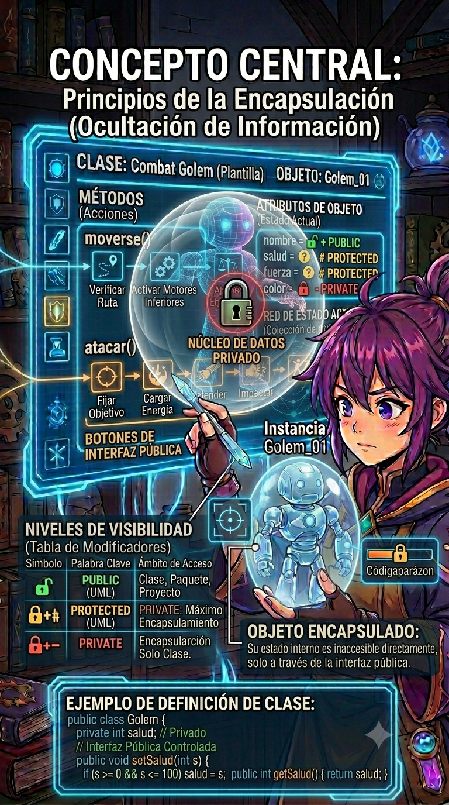

Un constructor se ejecuta automáticamente al crear un objeto.

```cpp
class Persona {
public:
    Persona() {
        std::cout << "Objeto creado"
                  << std::endl;
    }
};
```

---

# Constructor con Parámetros


```cpp
class Persona {
public:
    std::string nombre;

    Persona(std::string n) {
        nombre = n;
    }
};
```

---

# Uso del Constructor


```cpp
Persona persona("Juan");
```

---

# Destructor

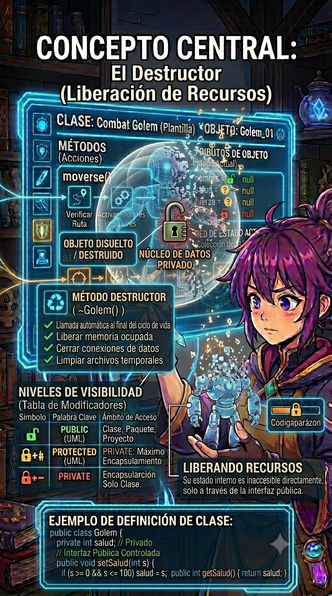

Un destructor se ejecuta automáticamente cuando un objeto deja de existir.

```cpp
class Persona {
public:
    ~Persona() {
        std::cout << "Objeto destruido"
                  << std::endl;
    }
};
```

---

# Constructor y Destructor

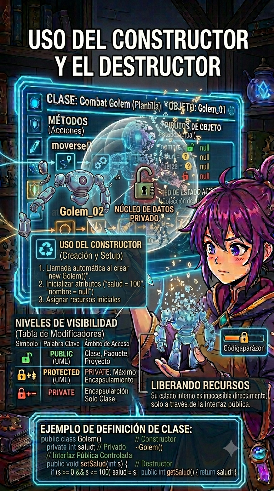

```cpp
class Persona {
public:
    Persona() {
        std::cout << "Constructor"
                  << std::endl;
    }

    ~Persona() {
        std::cout << "Destructor"
                  << std::endl;
    }
};
```

---

# this

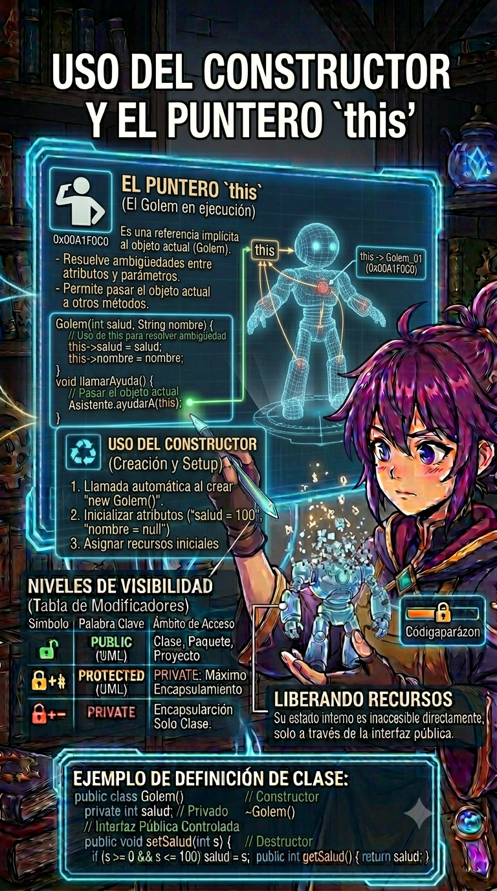

`this` es un puntero al objeto actual.

```cpp
class Persona {
private:
    std::string nombre;

public:
    Persona(std::string nombre) {
        this->nombre = nombre;
    }
};
```
---

# Multiples Archivos Fuente

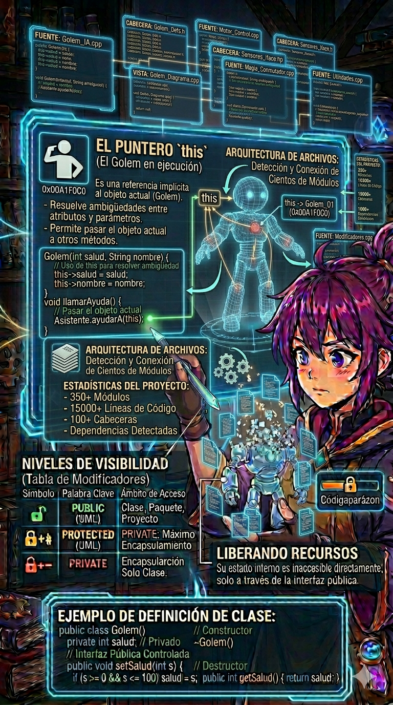

```cpp
// Persona.h
#pragma once

#include <string>

class Persona {
    std::string nombre;
    int edad;

public:
    Persona(std::string n, int e);
    void saludar();
};
```

---
# Multiples Archivos Fuente


```cpp
// Persona.cpp
#include "Persona.h"
#include <iostream>

Persona::Persona(std::string n, int e) {
    this->nombre = n;
    this->edad = e;
}

void Persona::saludar() {
    std::cout << "Hola, soy "
              << nombre
              << " y tengo "
              << edad
              << " años."
              << std::endl;
}
```

---
# Multiples Archivos Fuente


```cpp
// main.cpp
#include "Persona.h"

int main() {
    Persona persona("Juan", 20);
    persona.saludar();
    return 0;
}
```

---

# Compilación


Antes, con un único archivo:

```bash
clang++ main.cpp -o programa
```

Ahora, con múltiples archivos fuente:

```bash
clang++ main.cpp Persona.cpp -o programa
```

---

